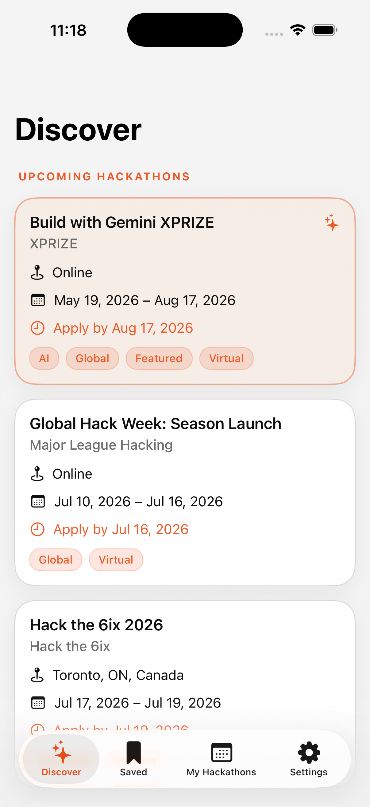
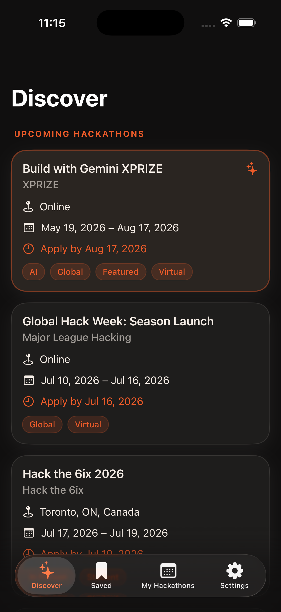
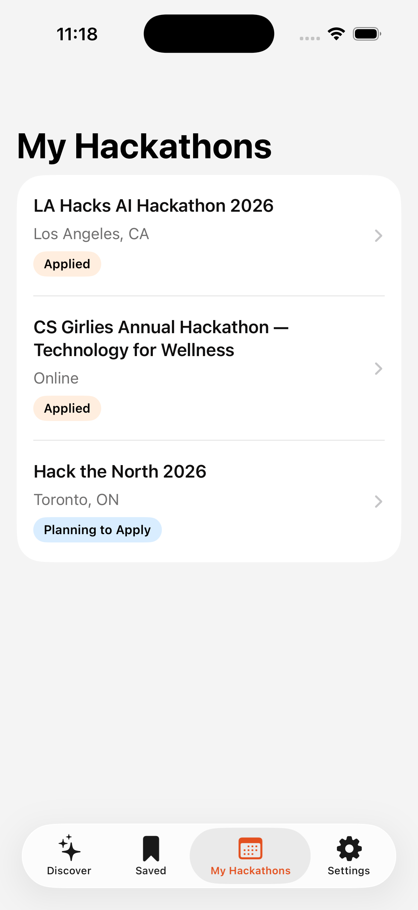
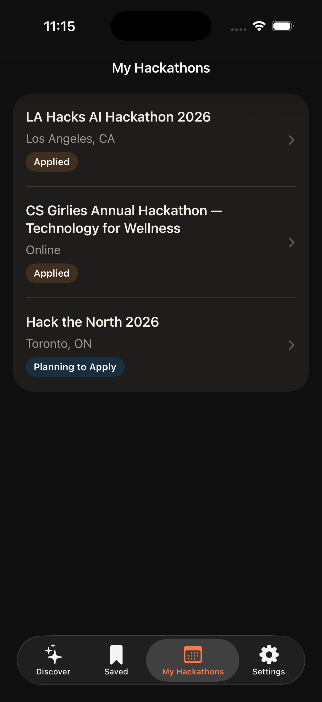
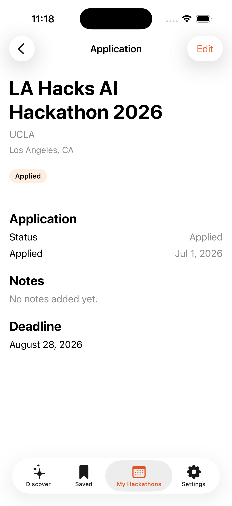
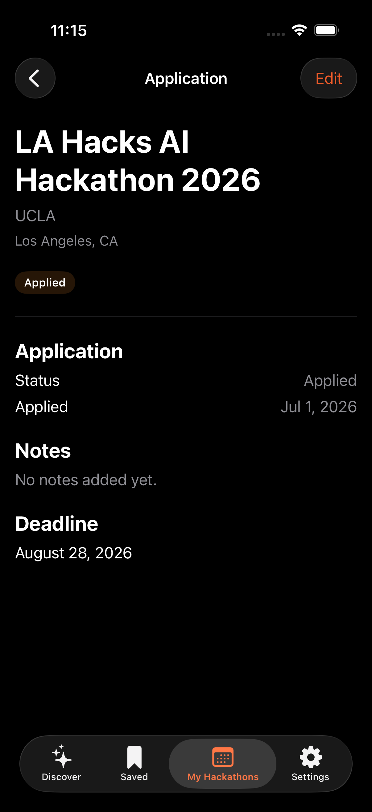
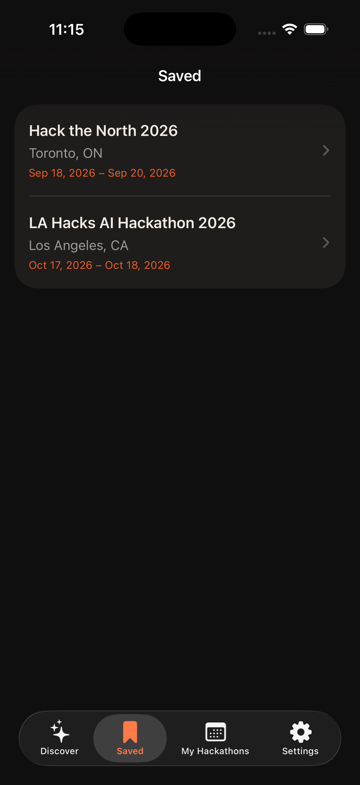
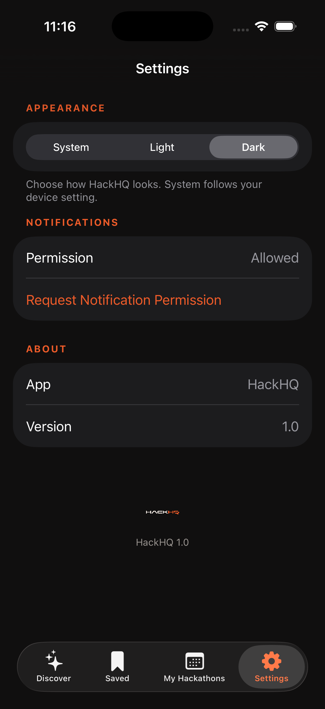
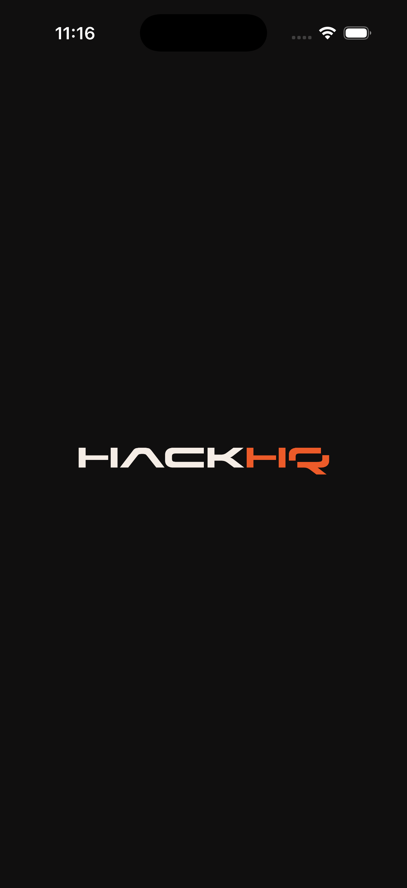

# HackHQ

A native iOS app for discovering hackathons, saving the ones you like, tracking your applications, and setting deadline reminders. Built with SwiftUI and SwiftData as a learning project, with a custom HackHQ brand design system.

## Features

- **Discover** — Browse a feed of upcoming hackathons as branded cards. Featured events are highlighted with a warm cream accent and orange edge.
- **Saved** — Bookmark hackathons and revisit them in a dedicated list.
- **My Hackathons** — Track applications with a status workflow (Interested, Planning, Applied, Accepted, Waitlisted, Rejected, Attending, Attended, Withdrawn), plus notes.
- **Reminders** — Schedule local notifications for application deadlines and other key dates.
- **Detail view** — Full event info (location, format, dates, deadline, tags, description) with actions to save, track, add reminders, open the website, and share.
- **Appearance** — System / Light / Dark theme preference, persisted across launches.
- **Animated splash** — A zoom-in launch screen with the HackHQ logo that blends seamlessly into the brand background in both light and dark mode.

## Screenshots

| Screen | Light | Dark |
| --- | --- | --- |
| Discover |  |  |
| My Hackathons |  |  |
| Detail |  |  |
| Saved | — |  |
| Settings | — |  |
| Splash | — |  |

## Tech stack

- **SwiftUI** for the UI
- **SwiftData** (`@Model`, `@Query`, `ModelContainer`) for persistence
- **UserNotifications** for deadline reminders
- **Asset catalog** for brand colors, the app icon, and light/dark logo art
- No third-party dependencies

## Requirements

- Xcode 26 or later
- iOS 26.5+ deployment target
- macOS with the iOS 26.5 simulator runtime (or a device on iOS 26.5+)

## Getting started

1. Clone the repo.
2. Open `hack-ios.xcodeproj` in Xcode.
3. Select the `hack-ios` scheme and an iOS 26.5+ simulator or device.
4. Build and run (`Cmd + R`).

On first launch the app seeds sample hackathon data via `SampleDataService` so the Discover feed isn't empty. To exercise reminders, grant notification permission from the Settings tab.

## Project structure

```
hack-ios/
├─ App/               App entry point, root container, splash, tab bar
│  ├─ hack_iosApp.swift
│  ├─ RootContainerView.swift   # hosts splash over the app, applies theme
│  ├─ RootTabView.swift
│  └─ SplashView.swift
├─ Features/          One folder per feature area
│  ├─ Discover/
│  ├─ Saved/
│  ├─ Applications/   # My Hackathons + application editor/detail
│  ├─ Reminders/
│  └─ Settings/
├─ Components/        Reusable views (HackathonCard, TagChip, StatusBadge)
├─ Models/            SwiftData models and enums
├─ Services/          SampleDataService, NotificationService
├─ Theme/             Brand design system (colors, typography, styles)
├─ Utilities/         Formatting helpers
└─ Assets.xcassets/   Colors, app icon, logo art
```

## Design system

The brand lives in `hack-ios/Theme/` and the asset catalog so styling stays consistent:

- **Colors** (`BrandColor.swift` + `*.colorset`)
  - `brandOrange` `#ED5B29` — primary accent (also the app accent color)
  - `brandBackground` — page background: neutral `#F4F4F4` (light) / ink `#100F0F` (dark)
  - `brandSurface` — cards/rows: white (light) / `#1E1D1C` (dark)
  - `brandCream` — warm accent for featured cards and the splash: `#F5EDE6` (light) / `#2A2521` (dark)
  - `brandInk` — primary text, plus derived `brandInkSecondary`, `brandHairline`, `brandOrangeSoft`
- **Typography** (`Theme.swift`) — system fonts styled with heavier weights and tracking for a technical feel, plus a `SectionEyebrow` label.
- **Reusable styling** — `.brandCard(featured:)` view modifier and `PrimaryBrandButtonStyle` / `SecondaryBrandButtonStyle`.
- **Appearance** (`AppTheme.swift`) — `AppTheme` enum persisted via `@AppStorage`, applied with `.preferredColorScheme` at the root.

> Note: Xcode's generated asset symbol extensions are disabled for this target so the hand-authored color tokens in `BrandColor.swift` are the single source of truth.

## Data model

- **Hackathon** — core event, with format, dates, deadline, tags, and `isFeatured` / `isSaved` flags. Owns an optional `Application` and a list of `DeadlineReminder`s (cascade delete).
- **Application** — the user's tracking record for a hackathon, with `ApplicationStatus`, notes, and timestamps.
- **DeadlineReminder** — a scheduled reminder tied to a hackathon and a local notification.
- **Tag** — many-to-many labels shared across hackathons.

## Testing

The project includes `hack-iosTests` (unit) and `hack-iosUITests` (UI) targets. Run them with `Cmd + U` in Xcode.
